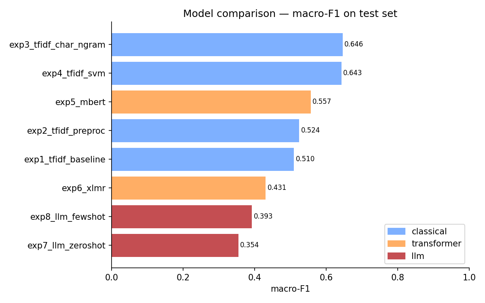

# Kyrgyz Hate Speech Detection

The first publicly described Kyrgyz hate-speech detection dataset (1,079
annotated YouTube comments) and an 8-system benchmark across classical ML,
fine-tuned multilingual transformers, and zero-/few-shot LLM prompting.

**Headline result.** Classical character-n-gram TF-IDF + Logistic Regression
reaches **macro-F1 = 0.646**, outperforming every neural system tested:
fine-tuned mBERT (0.557), XLM-RoBERTa (0.431), and Aya-Expanse-8B (0.354
zero-shot, 0.393 5-shot).

The result is consistent with a register mismatch: 89.8% of Kyrgyz YouTube
comments use the Russian keyboard rather than the Kyrgyz-specific Cyrillic
letters Ң, Ө, Ү, which differs from the formal-Cyrillic pretraining
distribution of the neural systems. Character n-grams are orthography-
resilient by construction; subword tokenisers are not.

## Read more

- **Full report:** [REPORT.md](REPORT.md) covers dataset construction,
  annotation schema, the 8-system benchmark, and discussion.
- **Reproduce on Helios:** [DOCUMENTATION.md](DOCUMENTATION.md) walks
  through env setup, SLURM job submission, and expected outputs.
