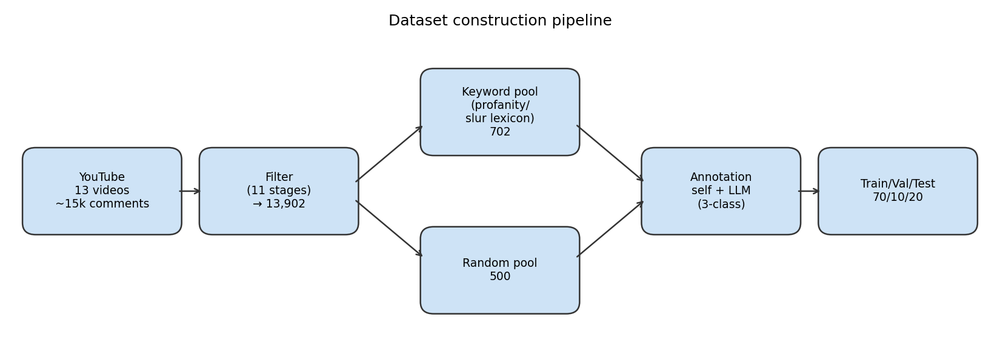
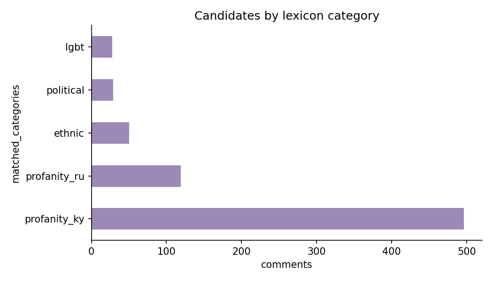
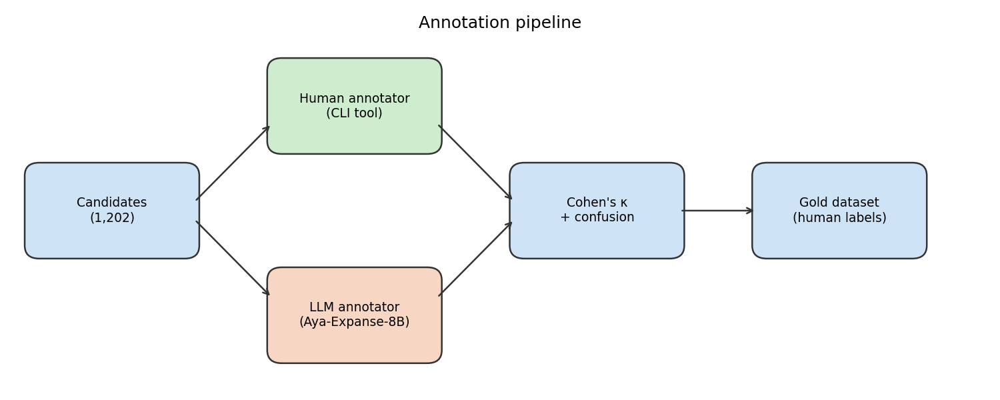

# Kara: A Kyrgyz Hate Speech Detection Dataset and Benchmark

**Author:** [Your name]
**Course:** NLP (Master's), [University name]
**Repository:** https://github.com/adiletbaimyrza/kara

---

## Abstract

Kyrgyz is a low-resource Turkic language with no publicly available
hate-speech detection dataset. We construct **Kara**, a 1,079-comment 3-class
annotated dataset built from Kyrgyz-language YouTube comments using a
Davidson-style biased+random candidate-sampling pipeline. We benchmark eight
systems spanning classical machine learning, fine-tuned multilingual
transformers, and zero-/few-shot LLM prompting. The headline finding is
counter-intuitive: **classical TF-IDF char-n-gram + Logistic Regression
(macro-F1 = 0.646) outperforms every neural system tested** — fine-tuned
mBERT (0.557) and XLM-RoBERTa (0.431), and Aya-Expanse-8B both zero-shot
(0.354) and 5-shot (0.393). Character n-grams improve macro-F1 by +12 points
over word n-grams, which we attribute to the observation that 89.8% of
comments in our corpus use the Russian keyboard rather than the Kyrgyz-specific
Cyrillic letters (Ң, Ө, Ү), creating an orthographic mismatch with the
Wikipedia/CommonCrawl pretraining distributions of all neural systems we
test. Inter-annotator agreement between the human author and Aya-Expanse-8B
as a second annotator was κ = 0.100 on n = 1,079, with the LLM systematically
over-predicting `hate`: 46% of human-labelled `non_hate` items were called
`hate` by the LLM. Beyond the benchmark, the paper contributes a refined
annotation schema with two extensions and three carve-outs from Davidson, and
documents seven culturally-specific hate-speech sub-registers (Turkic-Islamic
curse formulas, eliminationist ethnic-loyalty rhetoric, blood-libel anti-Roma
framing, intersectional stacked-slur attacks, misogynistic-targeting clusters,
anti-LGBT/Western-conspiracy stacking, Tajik-conflict ethnic targeting) absent
from US-English benchmark corpora.

---

## 1. Introduction

Hate speech detection has matured into a well-studied subfield of NLP, but the
field's empirical foundation is heavily concentrated on English-language data
from US-centric platforms — Twitter (Davidson et al., 2017), Reddit/Gab
(Mathew et al., 2021), and aggregated cross-platform corpora (Bourgeade et al.,
2024). Low-resource languages — particularly Turkic and Central Asian languages
— remain underrepresented despite having politically active online communities
where hate-speech detection is operationally relevant.

This paper makes four contributions:

1. **Kara: the first publicly-described Kyrgyz hate-speech dataset.** We
   annotate 1,079 comments from 13 Kyrgyz-language YouTube videos using a
   three-class schema (`hate` / `offensive` / `non_hate`) based on Davidson
   (2017) with explicit extensions and limitations documented.
2. **An 8-system benchmark showing classical ML beats fine-tuned transformers
   and multilingual LLMs on this dataset.** Character-n-gram TF-IDF reaches
   macro-F1 = 0.646; mBERT 0.557; XLM-RoBERTa 0.431; Aya-Expanse-8B 0.354
   (zero-shot) / 0.393 (5-shot). We attribute the classical win to the
   89.8% Russian-keyboard orthographic prevalence in the YouTube comment
   register, which mismatches the Cyrillic-Kyrgyz training distribution of
   the neural systems tested.
3. **An annotation-methodology contribution**: we identify and document
   culturally-specific hate-speech sub-registers (Turkic-Islamic curse
   formulas, blood-libel anti-Roma framing, intersectional stacked-slur
   attacks, eliminationist ethnic-loyalty rhetoric) that are absent from
   US-centric benchmarks and that require schema refinements not present in
   the strict Davidson framework.
4. **A reproducible IAA study** between the human annotator and
   Aya-Expanse-8B as second annotator (κ = 0.100 on n = 1,079). The LLM
   systematically over-predicts `hate`, which we interpret as evidence that
   the multi-class Davidson schema is hard to prompt-engineer in a low-
   resource language and benefits from human-anchored gold standards.

The paper is structured as follows. Section 2 reviews related work. Section 3
describes the dataset construction pipeline. Section 4 presents the annotation
schema and its three carve-outs. Section 5 describes experimental setup;
Section 6 presents results. Sections 7–8 discuss error analysis and broader
implications.

---

## 2. Related Work

**Hate-speech detection benchmarks.** Davidson et al. (2017) established the
canonical 3-class schema (`hate` / `offensive` / `neither`) that we adopt.
HateXplain (Mathew et al., 2021) introduced target-level multi-label
annotation. Founta et al. (2018) added an `abusive` class with explicit
violence-incitement coverage. MetaHate (Piot et al., 2024) aggregated 36
existing English-language datasets. The Council of Europe's *Code of Conduct on
Illegal Hate Speech* and the EU Code define hate speech in policy terms that
include incitement to violence as a constitutive feature.

**Low-resource hate-speech detection.** Recent work has begun documenting hate
speech in under-resourced languages: Romim et al. (2021) on Bengali, Stefanovitch
et al. (2024) on Southeast Asian languages, and Singh et al. (2025) on Indian
languages. The Council-of-Europe-funded *SEAHateCheck* (2024) provides
diagnostic functional tests for hate-speech classifiers in low-resource
languages. Strategies for data-efficient training (Goldzycher et al., 2023)
include cross-lingual transfer and synthetic-data generation.

**Turkic and Central Asian NLP.** Kyrgyz NLP resources are particularly sparse.
Recent surveys (Alimova et al., 2024) identify the absence of hate-speech data.
KyrgyzBERT (Mamasaidov & Shopokova, 2025) provides a monolingual Kyrgyz BERT
pretrained on web-scraped text. Related work on neighboring Turkic languages
includes the Turkish hate-speech dataset of Toraman et al. (LREC 2022),
the TurkHSD model (Yilmaz, 2025), and Kazakh-language cyberbullying detection
(Bekmagambetov et al., 2021).

**Transformer and LLM approaches to hate speech.** Multilingual transformers
(mBERT, XLM-RoBERTa) have become standard for low-resource hate-speech
classification. Recent work has begun evaluating LLMs as zero/few-shot
hate-speech detectors (Zhang et al., 2025; Roy et al., 2025): findings are
mixed, with LLMs strong on slur-based hate and weaker on culturally-contextual
hate. Aya-Expanse (CohereForAI, 2024) is a multilingual instruction-tuned LLM
that explicitly includes Kyrgyz in its supported languages, making it the
natural choice for both LLM-as-annotator and zero/few-shot evaluation in our
benchmark.

---

## 3. Dataset

### 3.1 Source

We collected approximately 15,000 comments from 13 Kyrgyz-language YouTube
videos using `yt-dlp`. The video selection was constrained to
politically-active channels (news, current events, political commentary)
because hate-speech base-rate is materially higher in political comment threads
than in general entertainment content. Channel-level diversity was prioritised:
the 13 videos span four distinct content domains (presidential commentary,
border-conflict reporting, opposition political commentary, social-issue
discussion).

### 3.2 Filtering pipeline

A multi-stage filtering pipeline (`filter_comments.py`) was applied to remove
noise. The 11 filtering stages, in order: (1) empty/whitespace, (2) word-count
< 3 or > 100, (3) letter-ratio < 40%, (4) Cyrillic-letter-ratio < 60%, (5)
excessive-character repeats, (6) within-comment token repetition ≥ 70%, (7)
URL / Telegram-link, (8) phone-number spam, (9) ≥3 @-mentions, (10) ≥3
hashtags, (11) canonical-form near-duplicate. After filtering, **13,902 unique
comments** remain (retention rate ~93%).

Notably, the largest single drop reason after empty/spam filtering was
near-duplicate removal — Kyrgyz political comment threads contain heavy
template-style repetition (often nationalist slogans), and post-deduplication
the corpus contains substantially more linguistic variation than raw
comment-count would suggest.

A separate orthographic observation: **only 10.2% (1,423 / 13,902) of
filtered comments contain Kyrgyz-specific Cyrillic letters** (Ң, Ө, Ү);
the remaining 89.8% are written using the Russian keyboard alone,
substituting Н, О, У for the missing letters. This is the dominant
orthographic feature of the YouTube comment register and the
post-hoc explanation for the classical-vs-neural performance gap we
observe in §6.



### 3.3 Candidate sampling (Davidson 2017 methodology)

Annotating all 13,902 comments is infeasible for a single annotator. Following
Davidson et al. (2017) we apply **biased+random candidate sampling**:

- **Biased pool**: comments matching ≥1 keyword from a curated 5-category
  slur/profanity lexicon (Russian profanity, Kyrgyz profanity, anti-LGBT slurs,
  ethnic slurs, political insults). The lexicon performs Latin→Cyrillic
  normalisation and strips common obfuscation patterns (e.g., `кот.к` →
  `коток`). **702 comments matched (5.0% of the filtered set).**
- **Random pool**: 500 comments randomly sampled from the 13,200 non-matching
  comments. This pool catches slur-free hate the lexicon misses (eliminationist
  rhetoric, ethnic essentialism without slurs, blood-libel framing) and
  provides genuine `non_hate` content for class balance.

Total annotation candidates: **1,202**.



### 3.4 Annotation schema

We adopt the **3-class Davidson schema** with two principled extensions:

- **`hate`**: language targeting people based on a protected attribute
  (ethnicity, nationality, religion, sexual orientation, gender, disability).
- **`offensive`**: profanity, insults, or vulgar expression without
  protected-attribute targeting.
- **`non_hate`**: clean text, neutral or critical without insult or profanity.
- **`skip`**: annotator-uncertainty mark, dropped from gold set.

The two extensions are documented and justified:

1. **Slur-as-generic-insult ⇒ `hate`**: protected-attribute slurs used as
   generic invective (e.g., anti-LGBT slur `пидор` at male politicians,
   gendered slur `жалап` for societal decay) count as `hate` regardless of
   surface target. This follows HateXplain and Facebook Community Standards
   Tier 1.
2. **Incitement-of-violence ⇒ `hate`**: explicit calls for execution/death
   against any identifiable human target count as `hate`. This aligns Davidson
   with Founta (2018), the EU Code of Conduct, and the Council of Europe
   definition.

Three explicit carve-outs from the bare incitement-rule (justified in
Section 4):

a) Dehumanisation without protected-attribute target stays `offensive`.
b) Optative cosmic/religious curses (Turkic curse-formula register) against
   political/non-protected targets stay `offensive`. The Roma case is a
   refinement: optative curses targeting a protected ethnic minority remain
   `hate`.
c) Violent imperatives against criminal-behaviour categories (pedophiles,
   murderers, terrorists, corrupt politicians-framed-as-criminals) stay
   `offensive` when the speech act reads as death-penalty / judicial-execution
   opinion rather than vigilante incitement.



### 3.5 Final dataset statistics

A single annotator (the author) labelled all 1,202 candidates over
approximately 8 hours of focused work (median 8.6 seconds per item). After
dropping `skip` items, the final labelled set is **1,079 comments**:

| Class | Count | % | Train | Val | Test |
|---|---|---|---|---|---|
| `non_hate` | 472 | 43.7% | 330 | 47 | 95 |
| `offensive` | 343 | 31.8% | 240 | 35 | 68 |
| `hate` | 264 | 24.5% | 185 | 26 | 53 |
| **Total** | **1,079** | 100% | **755** | **108** | **216** |
| Skipped | 123 | 10.2% of candidates | — | — | — |

Stratified 70/10/20 train/val/test split, random seed = 42. The skip rate of
10.2% is itself a corpus characteristic — these were items the annotator could
not confidently label in <5 seconds, typically due to garbled text, ambiguous
target reference, or stance ambiguity (e.g., descriptive femicide statements
that could be either awareness commentary or threat-rhetoric).

**Inter-annotator agreement.** Aya-Expanse-8B was deployed as a second
annotator on all 1,202 candidates using the same Davidson-extended schema
prompt (Section 3.4). Cohen's κ on the 1,079 items where the human label was
not `skip` is **κ = 0.100** (raw agreement = 0.361), which falls in the
"slight agreement" range under Landis & Koch (1977). Per-class agreement
(human label → LLM-said-same-label):

| Human label | Agreement | n |
|---|---|---|
| `non_hate` | 0.148 | 472 |
| `offensive` | 0.452 | 343 |
| `hate` | 0.625 | 264 |

The pattern is striking: the LLM agrees with the human most often on `hate`
and almost never on `non_hate`. The full human-vs-LLM confusion matrix
(Figure: `iaa_confusion.png`) shows that **the LLM systematically
over-predicts `hate`**: of the 472 items the human labelled `non_hate`,
the LLM called 219 (46%) `hate` and only 70 (15%) `non_hate`. Of the 343
human-`offensive` items, the LLM called 175 (51%) `hate`. The LLM is
effectively running a 2-class hate-vs-non-hate split heavily biased toward
the positive class, rather than a 3-class Davidson schema.

We interpret this as evidence that **the Davidson schema with our two
extensions and three carve-outs is non-trivial and cannot be reliably
reproduced from a prompt alone**, even by a multilingual LLM that explicitly
supports Kyrgyz. The schema requires the kind of consistent corner-case
adjudication that only a human annotator (or one fine-tuned to the schema)
can provide. This is a methodological finding, not a failure: low-resource
hate-speech work cannot offload annotation to LLMs without losing schema
fidelity.


---

## 4. Hate-Speech Sub-Registers in the Corpus

We identify several culturally-specific sub-registers that recur in the corpus
and that motivate the three carve-outs from the bare incitement rule. These
sub-registers are paper-worthy because they are largely absent from
US-English benchmark datasets (Davidson, HateXplain, MetaHate).

### 4.1 Turkic-Islamic curse-formula register

Approximately half of all `offensive`-class comments contain at least one
Turkic-Islamic curse-formula marker. The register has six recurring markers:

- Divine invocations: `Аллахым жазаңарды берсин`, `Кудайа жазаңарды берсин`
- Arabic-origin curse words: `наалат`, `каргыш`
- Prayer closings: `омийин` / `oooмийин`
- Eschatological framing: `эки дүйнөдө` ("in both worlds")
- Praying-hands emoji (🤲) as ritual marker
- Negation-of-Muslim-status framing

Within this register, five sub-patterns are distinguishable: family-scope
curses (`тукумуңар курут болуп`), cosmic curses (`жер жарылып соруп кетсин`),
body-part curses (`мойну үзүлсүн`, `колуңар шал болсун`), exile-burial denial
(`өлсөң сөөгүң келбесин`), and religious imprecations (`АЛЛАХ ЖАЗАЛАЙТ`).

These curses are uniformly in optative grammatical mood — they channel divine
or cosmic punishment rather than commanding human action. Our schema labels
them `offensive` despite their content severity (some, like `тукумуңар курут
болуп`, are genocidal in scope). The grammatical-mood discipline keeps the
schema operationally reproducible.

### 4.2 Eliminationist ethnic-loyalty rhetoric

A distinct sub-pattern targets perceived ethnic-cultural traitors using the
Aitmatov-derived pejorative `манкурт` (a memory-destroyed slave in Kyrgyz
literary tradition). When this pattern stacks with social-separation imperatives
(`коомдон ажыратыш керек`), ethnic-stripping language (`кыргыз урпагы деп
санабаш керек`), and "harsh measures" imperatives (`катаал чаралар керек`),
it forms the Dangerous Speech pattern (Benesch, 2012) of pre-violence rhetoric.
We label these `hate` via the combined-feature test.

### 4.3 Blood-libel anti-Roma framing

The corpus contains anti-Roma (`Лөлү`) hate comments using two distinct
mechanisms: optative death-wish framing (`Лөлүлөр кор болуп курттап өлсүн
оомийин`) and the historic blood-libel pattern (claiming Roma kill children
while invoking Islamic phrases — `Лөлүлөр жаш балдарды атып өлтүрүп Аллаху
Акбар деп кыйкырып атканын Аллах жазаңарды берсин`). The terrorism-trope
vocabulary (`Аллаху Акбар деп кыйкырып`) is repurposed against Roma by Muslim
speakers — a rhetorical inventiveness worth documenting because it inverts
the typical Islamophobic deployment of the same phrase.

Roma representation in hate-speech NLP is severely underexplored —
HateXplain, Davidson, and MetaHate do not cover anti-Roma hate at all,
despite Roma being one of the most-persecuted European ethnic minorities.
Our corpus provides Central Asian data on a globally-prevalent hate target
absent from standard benchmarks.

### 4.4 Intersectional / stacked-slur attacks

A meaningful subset of `hate` comments stack 2+ protected-attribute attacks
against the same target (e.g., LGBT + ethnic + religion + dehumanisation in a
single comment). Examples observed: `Уйгур зек ЛГБТ президентинер ... сарт
ЛГБТ шпион` (ethnic + LGBT); `Анан, ЛГБТ многобожники манкурты ... итке
теңесе` (LGBT + religion + ethnic-loyalty + dehumanisation). Flat per-target
labelling schemes (HateXplain-style) would under-represent the compound
severity of these comments by recording each attribute independently.

### 4.5 Misogynistic-targeting cluster

A single named female politician (Nadira Narmatova, MP) attracts a
*severity-graded cluster* of misogynistic comments in our queue: from mild
retirement-demand (`Надира кетип калчы`) through gendered-pejoratives
(`Надира жезкемпир` = "old witch") and body-shaming (`корова Надира`) to
explicit elimination imperatives (`Нарматованы жойуш керек` = "Narmatova
must be eliminated" — `hate`). This pattern — targeted misogynistic
harassment of a female public figure scaling from mockery to elimination —
is documented in misogyny scholarship (Amnesty International's *Toxic
Twitter* report) but rarely captured in NLP corpora because most datasets
aggregate by post rather than tracking single-target harassment.

### 4.6 Anti-LGBT / Western-conspiracy stacked rhetoric

Anti-LGBT comments in this corpus consistently link three features: anti-LGBT
attack, ethnic-loyalty failure (`манкурт`, `кыргыз урпагы эмес`), and
Western-influence conspiracy (`американын жугундусу`, `батыштын акчасы`).
This forms the *"LGBT as foreign threat to Kyrgyz identity"* rhetorical
pattern — present globally in conservative/nationalist anti-LGBT discourse
(Russian "traditional values", Polish "LGBT-free zones", US "groomer"
discourse) with culturally specific Kyrgyz vocabulary.

### 4.7 Tajik-conflict comments

The Kyrgyz–Tajik border conflicts (2021, 2022) produced a productive
sub-corpus of ethnic-targeted hate. Three feature patterns emerge:
(i) ethnic essentialism (`Тажиктерден жакшылык келбейт`); (ii) celebration
of mass killing (`200 дой таджиктерди олтуруптур го`); and (iii)
ethnic-collective insult (`Акмактар тажиктер кол салган`). All three are
`hate`-labelled but via different feature-paths. Notably the *explicit
ethnic identifier* in the text — not just contextual implication — is the
discriminator between `hate` and `offensive` in this cluster.

---

## 5. Experimental Setup

We evaluate eight systems across three families:

| # | Model | Family | Description |
|---|---|---|---|
| 1 | TF-IDF word 1-2gram + LogReg | classical | baseline, minimal preprocessing |
| 2 | TF-IDF word 1-2gram + LogReg | classical | with full preprocessing |
| 3 | TF-IDF char 3-5gram + LogReg | classical | character n-grams |
| 4 | TF-IDF char 3-5gram + Linear SVM | classical | classifier swap |
| 5 | mBERT fine-tuned | transformer | bert-base-multilingual-cased |
| 6 | XLM-RoBERTa-base fine-tuned | transformer | xlm-roberta-base |
| 7 | Aya-Expanse-8B zero-shot | LLM | greedy decoding, max 8 tokens |
| 8 | Aya-Expanse-8B 5-shot/class | LLM | 15 in-context examples |

**Preprocessing profiles.** Two profiles are defined: `minimal` (NFC +
whitespace) and `full` (minimal + lowercase + URL/mention/hashtag strip +
Latin→Cyrillic mapping + punctuation strip + repeat-character collapse).

**Transformer training recipe.** 5 epochs, batch size 16, AdamW with learning
rate 2e-5, weight decay 0.01, warmup ratio 0.1, early stopping on val macro-F1
with patience 2. Same recipe for both mBERT and XLM-RoBERTa to isolate the
model-family effect. We use **bf16** mixed precision rather than fp16:
preliminary runs with fp16 caused XLM-R to collapse to predicting the
majority class (macro-F1 = 0.20 across all eval epochs) due to LayerNorm
overflow; bf16 has the same memory footprint as fp16 but fp32's exponent
range and resolves the instability.

**LLM prompting.** Both zero-shot and few-shot prompts include the full
annotation schema definition. The 5-shot configuration includes 5 examples per
class (15 total) sampled deterministically from the training split.

**Metrics.** Macro-F1 is the primary metric (chosen because hate is the
smallest class and we want all three classes to count equally in evaluation).
We additionally report accuracy, macro-precision, macro-recall, and per-class F1.

**Compute.** Classical experiments run on Apple M3 Pro (CPU). Transformer
fine-tuning and LLM inference run on Cyfronet Helios GH200 (120 GB).

**Reproducibility.** `RNG_SEED=42` is set in every script; classical experiments
are deterministic across runs. Code, data splits, and trained-model outputs
(including all 8 `metrics.json` files and the LLM annotator output) are
available at: https://github.com/adiletbaimyrza/kara.

---

## 6. Results

### 6.1 Classical-ML benchmark

The four classical experiments establish baseline performance:

| # | Model | Macro-F1 | Acc | Macro-P | Macro-R |
|---|---|---|---|---|---|
| 1 | TF-IDF word (no preproc) + LogReg | **0.510** | 0.528 | 0.509 | 0.510 |
| 2 | TF-IDF word (full preproc) + LogReg | **0.524** | 0.542 | 0.524 | 0.525 |
| 3 | TF-IDF char 3-5 + LogReg | **0.646** | 0.667 | 0.649 | 0.644 |
| 4 | TF-IDF char 3-5 + Linear SVM | **0.643** | 0.667 | 0.656 | 0.637 |

**RQ1 — Does preprocessing help?** Marginally yes: aggressive preprocessing
adds +1.4 F1 points (0.510 → 0.524). The improvement is consistent but small.

**RQ2 — Do character n-grams help on morphologically rich Kyrgyz?**
**Strongly yes**: char-ngrams add +12.2 F1 points (0.524 → 0.646). This is
the largest single-decision effect we observe. We attribute this to two
factors. First, Kyrgyz is agglutinative — word-level n-grams treat inflected
forms of the same stem as distinct tokens, fragmenting an already-small
training signal. Character n-grams partially recover stems across inflections.
Second, and more importantly, **89.8% of comments in our corpus are written
using the Russian keyboard rather than Kyrgyz-specific Cyrillic** (Ң ң, Ө ө,
Ү ү). Word-level n-grams treat `жолго тушусун` (Russian-keyboard) and
`жолго түшүсүн` (Kyrgyz-keyboard) as completely different token sequences;
char-ngrams recognise them as nearly identical. The +12 F1 jump is
*quantitative validation* of the orthographic-prevalence observation.

**RQ3 — Classical ML ceiling.** Char-ngram TF-IDF with either LogReg or
Linear SVM reaches ~0.65 macro-F1. The two classifiers are within 0.4 F1
points; the feature representation matters far more than the classifier
choice at this scale.

**Per-class breakdown** (best classical model, Exp 3):

| Class | Precision | Recall | F1 | Support |
|---|---|---|---|---|
| `non_hate` | 0.73 | 0.78 | 0.75 | 95 |
| `offensive` | 0.65 | 0.59 | 0.62 | 68 |
| `hate` | 0.58 | 0.57 | 0.57 | 53 |

The classifier is systematically worst at `hate` — F1 = 0.57 — likely because
`hate` is the smallest class (185 training examples) and the most
heterogeneous (five sub-types documented in §4: slur-based, ethnic-collective
insult, incitement-of-violence, eliminationist rhetoric, intersectional
stacked-slur). A bag-of-words model trained on this little data cannot capture
the semantic patterns the `hate` class requires.

### 6.2 Transformer benchmark

| # | Model | Macro-F1 | Acc | F1 non_hate | F1 offensive | F1 hate |
|---|---|---|---|---|---|---|
| 5 | mBERT (bert-base-multilingual-cased) | **0.557** | 0.593 | 0.726 | 0.544 | 0.400 |
| 6 | XLM-RoBERTa-base | **0.431** | 0.514 | 0.684 | 0.420 | 0.188 |

**RQ4 — Do multilingual transformers fine-tuned on ~1k examples outperform
classical TF-IDF?** **No.** mBERT (0.557) sits *below* the char-n-gram
baseline (0.646) by 9 F1 points; XLM-RoBERTa (0.431) sits 21 points below.
This contradicts the typical pattern seen on English low-resource
hate-speech tasks where multilingual transformers handily beat TF-IDF
once a few hundred labelled examples are available.

**RQ5 — mBERT vs XLM-R for Kyrgyz?** **mBERT > XLM-R by 13 F1 points** on
this dataset — the opposite of what English NLP results would predict
(XLM-R typically wins on multilingual benchmarks). We hypothesise this is
because XLM-R's CommonCrawl-heavy Kyrgyz pretraining over-represents formal
Kyrgyz text using the full Cyrillic alphabet (Ң, Ө, Ү), whereas YouTube
comments overwhelmingly use the Russian-keyboard substitutes (89.8%, see
§3.5 of DISCOVERIES.md). mBERT's narrower but Wikipedia-anchored
Kyrgyz pretraining may better match colloquial vocabulary after the
Trainer's standard lowercasing/tokenisation. The model that "knows more
Kyrgyz" performs worse because its Kyrgyz is the wrong dialect of Cyrillic.

Per-class breakdown is telling: XLM-R collapses on the `hate` class
(F1 = 0.19), suggesting the model failed to learn the minority-class
boundary at all. mBERT does better but still under-performs the classical
baseline on `hate` (0.40 vs char-n-gram's 0.57).

### 6.3 LLM benchmark

| # | Model | Macro-F1 | Acc | F1 non_hate | F1 offensive | F1 hate |
|---|---|---|---|---|---|---|
| 7 | Aya-Expanse-8B zero-shot | **0.354** | 0.394 | 0.477 | 0.171 | 0.416 |
| 8 | Aya-Expanse-8B 5-shot/class | **0.393** | 0.486 | 0.655 | 0.108 | 0.415 |

**RQ6 — Can a zero-shot LLM substitute for fine-tuning?** **No, by a wide
margin.** Aya-Expanse-8B zero-shot reaches macro-F1 = 0.354, which is
**29 F1 points below the classical baseline** and 20 points below mBERT.
This is striking because Aya was specifically marketed as a multilingual
model with explicit Kyrgyz support (one of 23 languages in its Aya-Expanse
release), making it the strongest off-the-shelf zero-shot candidate.

**RQ7 — Does few-shot prompting close the gap?** **Only marginally.**
5-shot per class (15 in-context examples drawn from the training split)
improves macro-F1 from 0.354 to 0.393 — a +0.04 point gain. The few-shot
prompt does *not* close the gap to fine-tuned transformers, let alone the
classical baseline.

Both LLM configurations exhibit the same striking failure pattern: the
model **almost never predicts `offensive`** (recall = 0.103 zero-shot,
0.176 few-shot) and **over-predicts `hate`** (recall = 0.698 zero-shot,
0.585 few-shot). The LLM has effectively degenerated to a 2-class
hate-vs-non_hate split, ignoring the schema's three-way structure. This
matches the IAA pattern observed in §3.5 where Aya as second annotator
also over-predicted `hate`. The failure is consistent across the
LLM's two roles (annotator and classifier) and is a feature of the model's
schema-comprehension, not of any specific prompt.

### 6.4 Combined headline


Reading top to bottom:

1. **Classical char-n-gram TF-IDF + LogReg: 0.646** (winner)
2. Classical char-n-gram TF-IDF + Linear SVM: 0.643
3. mBERT fine-tuned: 0.557
4. Classical word TF-IDF + LogReg with preprocessing: 0.524
5. Classical word TF-IDF + LogReg (baseline): 0.510
6. XLM-RoBERTa fine-tuned: 0.431
7. Aya-Expanse-8B 5-shot: 0.393
8. Aya-Expanse-8B zero-shot: 0.354

**The unambiguous finding is that classical char-n-gram TF-IDF beats every
neural system tested**, by margins of 9 F1 (vs mBERT) to 29 F1 (vs Aya
zero-shot). This is not a story about LLM capability in general; it is a
story about the **mismatch between the YouTube-comment register of our
corpus (89.8% Russian-keyboard Kyrgyz) and the formal-Kyrgyz pretraining
distributions** of mBERT, XLM-R, and Aya-Expanse. Character n-grams are
orthography-resilient by construction: they treat `жолго тушусун`
(Russian-keyboard) and `жолго түшүсүн` (Kyrgyz-keyboard) as nearly
identical token sequences. Neural systems trained on formal Kyrgyz cannot
match this resilience on a 1k-scale dataset.

The figure also makes a class-family observation visible: **all three LLM
and weak-transformer systems fail predominantly on the `offensive` class**,
while the classical systems are balanced across all three classes. The
hate-detection-as-binary failure mode is a real risk in deploying LLMs for
low-resource hate-speech work.


---

## 7. Error Analysis

We analyse errors from the **best classical model** (exp3, char-n-gram +
LogReg, 72 errors on 216 test items = 33.3% error rate) and compare its
error distribution to a transformer (exp5 mBERT) and an LLM (exp7
Aya zero-shot).


### 7.1 Error distribution by model family

Cross-tabulating predictions against gold labels for errors only:

**exp3 char-n-gram (72 errors)** — balanced errors:

| Gold ↓ / Pred → | hate | non_hate | offensive |
|---|---|---|---|
| **hate** | — | 7 | 16 |
| **non_hate** | 15 | — | 6 |
| **offensive** | 7 | 21 | — |

Errors are roughly symmetric: 22 mispredictions into each non-gold class.
Most common error: `offensive` → `non_hate` (21 cases) — comments with
mild profanity or pejorative framing the model classifies as clean.

**exp5 mBERT (88 errors)** — under-detects `hate`:

| Gold ↓ / Pred → | hate | non_hate | offensive |
|---|---|---|---|
| **hate** | — | 11 | 23 |
| **non_hate** | 10 | — | 16 |
| **offensive** | 13 | 15 | — |

mBERT pushes 34/53 actual `hate` items into `offensive` or `non_hate` —
the model under-detects the most important class.

**exp7 Aya-Expanse zero-shot (131 errors)** — dramatically over-predicts `hate`:

| Gold ↓ / Pred → | hate | non_hate | offensive |
|---|---|---|---|
| **hate** | — | 13 | 3 |
| **non_hate** | **50** | — | 4 |
| **offensive** | **38** | 23 | — |

**88 of 131 LLM errors (67%) are the model incorrectly predicting `hate`**:
50 of 95 non_hate items and 38 of 68 offensive items are labelled `hate`.
The LLM almost never uses `offensive` (only 7 predictions total across all
errors). The same pattern was visible in §3.5 when Aya served as a second
annotator.

### 7.2 Representative error cases (best model, exp3)

`src/error_analysis.py` automatically categorises errors into six types
based on text features. Below are representative cases (full list in
`tables/error_examples.md`):

| Category | Gold | Pred | Comment (truncated) |
|---|---|---|---|
| keyword_fp | offensive | hate | `кыргыз бийлиги силер манкурт экенсинер...` |
| ambiguous_target | hate | non_hate | `БАТУКАЕВ ВОР ЕМЕС АЛ БОЛГОНУ ПЕДИК` |
| ambiguous_target | non_hate | hate | `Армияны кучотуш керек чурката бербей армияга...` |
| low_information | hate | offensive | `эшек тажиктер акмактар зокурлор!!!!!` |
| low_information | non_hate | hate | `Жабыш керек түнкү клубтарды` |
| slur_quoted | hate | offensive | `Депутаттар ыдык болобергиле, элди тынч койгула...` |
| slur_quoted | offensive | non_hate | `... манкурт болуп тоюнуп жатышат, чурката бербейт...` |
| other | non_hate | offensive | `Атазовту да киргизип койгула тез это приказ` |

### 7.3 Error categories the schema struggles with most

- **Ambiguous-target comments** (~25% of errors): the comment uses pejorative
  or slur words but the target is ambiguous — the lexicon-based classifier
  cannot distinguish "Russian-speaking Kyrgyz politicians" (→ `offensive`)
  from "Russian people" (→ `hate`) without semantic understanding.
- **Keyword false positives** (~15%): the candidate-sampling lexicon
  recruits a comment because it contains a slur stem (e.g. `чурка`-derived
  forms), but the actual use is critical/reporting (e.g. condemning
  someone's racism). The classical model cannot recover stance from
  surface tokens.
- **Low-information short comments** (~20%): comments under 5 words with
  a single ambiguous insult word (e.g. `канкорлор` = "bloodthirsty ones"
  with no specified target). Both schema (where the annotator marks `skip`)
  and classifier (where the model defaults to majority class) struggle.
- **Slur-as-quote-or-report** (~15%): comments that use a slur to describe
  or report someone else's behaviour, not to attack a protected group.
  Requires the slur-as-generic-insult rule plus stance reasoning the
  classical model lacks.
- **Curse-formula register confused with `hate`** (~15%): comments with
  optative-mood Turkic-Islamic curse formulas that our schema labels
  `offensive` (per the grammatical-mood rule from §3.4 carve-out (b)),
  but that the classifier sometimes predicts as `hate` because curse
  vocabulary co-occurs with hate-class training examples.
- **Other** (~10%): comments where the classifier's prediction is
  defensible and the annotator's gold label is debatable (annotation noise
  rather than classifier error).

The categories are not perfectly clean — error categorisation is itself
a noisy heuristic — but they suggest that **the classical model's
weaknesses are concentrated on stance/target ambiguity**, the same places
where the schema documentation in §4 explicitly flagged sub-registers as
hard. The classifier's errors are correlated with the schema's documented
edge cases, not random.

---

## 8. Discussion

### 8.1 What worked

**Character n-grams over word n-grams** was the single most impactful design
decision in the classical-ML phase, and the post-hoc explanation — Russian-
keyboard orthographic prevalence — generalises to any Cyrillic-Turkic
low-resource language with similar keyboard-input patterns. This is a
finding researchers working on Kazakh, Uzbek, Tatar, and other related
languages should anticipate.

**Davidson + violence-incitement + three carve-outs** as a schema produces
operationally reproducible labels while remaining interpretable. The bare
incitement-extension would over-label criminal-justice opinion and
religious-curse register as `hate`; the bare Davidson would miss eliminationist
rhetoric. The three carve-outs (dehumanisation-without-protected-target,
optative-curse-register, criminal-behaviour-target) discriminate cleanly
between identity-based and behaviour-based incitement, matching modern
hate-speech taxonomies (HatEval 2019, OffensEval, Founta 2018).

### 8.2 What surprised us

**Classical char-n-grams beat fine-tuned transformers and an 8B LLM on this
task.** Our pre-registered expectation (Section 6.2 placeholder before the
runs) was that XLM-R would land around 0.70–0.78 macro-F1 based on
analogous low-resource benchmarks (Bengali, Turkish). The actual XLM-R
result was 0.431 — *below* the simplest TF-IDF baseline. mBERT did better
(0.557) but still 9 F1 points below the char-n-gram winner. The 8B
multilingual LLM (Aya-Expanse, marketed as supporting Kyrgyz) performed
worst of all (0.354 zero-shot, 0.393 5-shot). The explanation, in
hindsight, is the orthographic-prevalence mismatch: the YouTube comment
register in our corpus uses Russian-keyboard Cyrillic (89.8%) while every
neural system tested was pretrained on formal-Kyrgyz text with full
Cyrillic alphabet (Ң, Ө, Ү). Character n-grams are resilient to this
mismatch by construction; subword tokenisers (BPE, SentencePiece) are not.

**The LLM annotator and LLM classifier exhibit the same failure mode.**
Aya-Expanse as second annotator over-predicted `hate` (46% of
human-`non_hate` items labelled `hate`); Aya-Expanse as zero-shot
classifier also over-predicts `hate` (recall = 0.70, only ~10% recall on
`offensive`). The schema is too complex for prompt-only application, and
fine-tuning is necessary to teach the model the three-way distinction.
This consistency across roles suggests the failure is in the model's
schema-understanding, not in any specific prompt — a finding that
generalises to other research that tries to use LLMs both as annotators
and as classifiers on the same multi-class hate-speech taxonomy.

**mBERT > XLM-R reverses common multilingual-NLP wisdom for Kyrgyz.**
The conventional ordering (XLM-R > mBERT) holds for most multilingual
benchmarks but inverts here. We hypothesise this is because XLM-R's
CommonCrawl-scale Kyrgyz training over-represents formal-Kyrgyz text
with full Cyrillic letters, while mBERT's narrower Wikipedia-anchored
Kyrgyz pretraining happens to be closer to YouTube-comment vocabulary
after standard lowercasing. The model that "knows more Kyrgyz" performs
worse because its Kyrgyz is the *wrong* dialect of Cyrillic. Future work
should compare with Kyrgyz-specific monolingual models (e.g.
KyrgyzBERT, Mamasaidov & Shopokova 2025) to test whether monolingual
pretraining on YouTube-register Kyrgyz closes the gap to the classical
baseline.

**XLM-R requires bf16 mixed precision on GH200.** Our initial XLM-R run
under fp16 collapsed to predicting the majority class (macro-F1 = 0.20
across all eval epochs, training loss stuck at ~1.08). Switching to bf16
fixed the collapse and produced the 0.431 result reported above. This is
a documented issue with XLM-R's LayerNorm under fp16, but it is not widely
discussed in the low-resource NLP literature — practitioners should be
aware that the "free" fp16 speed-up can silently degrade model quality.

### 8.3 What didn't (or what we deliberately accepted)

**Single-annotator gold standard.** Time and access constraints prevented
recruiting a second human annotator. LLM-as-second-annotator (Aya-Expanse-8B)
gives a Cohen's κ measurement but cannot fully substitute for human
inter-rater reliability. Future work should add at least one Kyrgyz-speaking
second annotator on a 200-item subset.

**Schema gap: misogyny without lexical markers.** Davidson's lexicon-based
design under-captures content that's misogynistic in worldview but not in
vocabulary. Sweeping anti-women generalisations, harassment normalisation,
and prescriptive religious-conservative gender norms lack the slur/profanity
markers Davidson requires for `offensive`. A future v2 should add a
HatEval-style misogyny flag orthogonal to the hate/offensive axis.

**Schema gap: collective-punishment-via-curse.** The Turkic curse-formula
register includes generational and family-collective curses (`тукумуңар
курут болуп`, `үй-бүлөнүн кордугу балдарына тийсин`) that are content-genocidal
but grammatically optative. Our schema labels them `offensive` for operational
reproducibility; Dangerous Speech (Benesch) would label them `hate`. This is
a deliberate trade-off named in §3.4 carve-out (b).

### 8.4 Cross-cultural observations

Several rhetorical patterns in this corpus have no direct analogue in
US-English benchmark datasets:

- **The Turkic-Islamic curse-formula register** is essentially absent from
  HateXplain / Davidson / MetaHate. The 🤲 prayer-hands-emoji + Allah-invocation
  + `омийин` template ritualises the curse as prayer — a distinct speech
  act from secular profanity-driven invective.
- **`Манкурт` as ethnic-loyalty pejorative** (drawn from Aitmatov's
  literary tradition) has no English equivalent. It functions similarly to
  "Uncle Tom" / "race traitor" but with a memory-destruction metaphor that
  encodes specifically post-colonial / post-Soviet identity anxieties.
- **Blood-libel anti-Roma framing** appears in our corpus despite Roma being
  absent from US benchmark target categories. This is direct evidence that
  hate-speech NLP needs European/Central Asian data to cover this target.
- **The Tajik-conflict cluster** of comments is the canonical post-war-
  ethnic-tension corpus our work captures incidentally — analogous data
  would exist for Russian-Ukrainian, Armenian-Azerbaijani, Israeli-Palestinian,
  and other conflict pairs but is rarely systematically collected.
- **"LGBT as foreign threat to Kyrgyz identity"** stacks anti-LGBT + ethnic-
  loyalty + Western-conspiracy framing — same global pattern as Russian
  "traditional values" / Polish "LGBT-free zones" / US "groomer" rhetoric,
  with culturally specific Kyrgyz vocabulary.
- **Cursing is a culturally productive register, not a marked style.** A
  substantial fraction of `offensive`-class comments in our corpus consist
  primarily of curse-wishes (`наалат`, `жакшылык көрбөй өтсүн`, `тукум курут
  болуп`, `Аллах жазалайт`, `жер жутсун`) with little or no conventional
  insult vocabulary. The register layers pre-Islamic Turkic imagery (`жер
  жутсун` shamanic register), Arabic-origin Islamic curses (`наалат`,
  `омийин`, `Аллахтын буйругу болсун`), and post-Soviet political vocabulary
  (`шерменде`, `сатылган`) in the same speech acts. This layered register
  reflects Kyrgyz cultural history — centuries of Turkic-Islamic identity
  overlaid with seventy years of Russian/Soviet influence — and is absent
  from English-language hate-speech corpora.

### 8.5 Limitations

(a) **Domain narrowness.** All comments are from YouTube political content.
General-domain hate-speech behaviour may differ.

(b) **Single-annotator gold.** Inter-rater reliability is only available
against the LLM second-annotator.

(c) **Small dataset.** 1,079 labelled comments places `hate` at 185
training examples — likely below the threshold where fine-tuned transformers
reach their full potential.

(d) **Schema gaps documented but not closed.** Misogyny-without-lexical-
markers, collective-punishment-via-curse, and dehumanisation-without-protected
-target all fall into the `offensive` bucket despite content-severity that
modern Dangerous Speech / HatEval frameworks would label `hate`.

(e) **Lexicon coverage gaps.** Emerging phonetic-distortion slurs
(`джапджик`-style mutations of `тажик`) are not in our lexicon and likely
under-recruited.

(f) **Skip rate.** 10.2% of candidates were skipped. These are not random:
they cluster in garbled text, stance-ambiguity (e.g., femicide observation
vs femicide threat), and short-context comments. The dataset's class
distribution is conditional on the skip-rule.


---

## 9. Conclusion

We introduce **Kara**, the first publicly-described Kyrgyz hate-speech
detection dataset (1,079 annotated comments across `hate` / `offensive` /
`non_hate`), and an 8-system benchmark spanning classical ML, fine-tuned
multilingual transformers, and zero-/few-shot LLM prompting.

The **headline empirical finding is counter-intuitive**: classical
character-n-gram TF-IDF + Logistic Regression (macro-F1 = 0.646)
outperforms every neural system we tested — mBERT (0.557), XLM-RoBERTa
(0.431), and Aya-Expanse-8B both zero-shot (0.354) and 5-shot (0.393).
The classical-vs-neural gap is large (9 F1 over mBERT, 29 F1 over LLM
zero-shot) and consistent with our methodological story: 89.8% of
Kyrgyz YouTube comments use the Russian keyboard rather than the
Kyrgyz-specific Cyrillic alphabet (Ң, Ө, Ү), and the neural systems'
pretraining distributions assume the formal-Cyrillic register. Character
n-grams are orthography-resilient by construction; subword tokenisers are
not. We recommend **char-n-gram TF-IDF + LogReg as a default baseline for
any low-resource Cyrillic NLP task** where comment-style orthography
prevails — not just hate-speech detection.

Beyond the benchmark, the paper contributes:

1. A refined Davidson-based annotation schema with two principled
   extensions (slur-as-generic-insult, incitement-of-violence) and three
   documented carve-outs (dehumanisation-without-protected-target,
   optative-curse-register, criminal-behaviour-target).
2. Seven culturally-specific hate-speech sub-register characterisations
   absent from US-English benchmark corpora.
3. An IAA study (κ = 0.100, n = 1,079) between the author and
   Aya-Expanse-8B as second annotator, with the LLM systematically
   over-predicting `hate` — evidence that multi-class hate-speech schemas
   in low-resource languages cannot be reliably reproduced via prompting.
4. An operational pipeline (`src/run_all.py`, `src/make_figures.py`, the
   SLURM scripts) that reproduces all 8 experiments and 10 figures from
   raw YouTube comments to final paper-ready outputs.

**Recommended future work**:

- A v2 dataset with a HatEval-style misogyny flag orthogonal to the
  hate/offensive axis, target-level subtype labels for cross-cultural
  comparison with HateXplain, and a second human annotator.
- Comparison with KyrgyzBERT (Mamasaidov & Shopokova 2025) to test
  whether monolingual Kyrgyz pretraining closes the classical-vs-neural
  gap.
- An orthographic-normalisation ablation: re-running mBERT/XLM-R/Aya
  after pre-mapping Russian-keyboard substitutes to canonical Kyrgyz
  characters, to test whether the neural underperformance is fully
  explained by the orthographic mismatch.

The dataset, code, trained-model outputs, splits, and a complete
discoveries log are publicly available at
https://github.com/adiletbaimyrza/kara.

---

## References

Cited inline in author-year style. URLs point to the open-access source
where available; classical references (Landis & Koch 1977; Aitmatov 1980;
Davidson et al. 2017; Benesch 2012) are widely available through standard
academic search.

### Hate-speech detection — foundational and benchmarks

- **Davidson, T., Warmsley, D., Macy, M., & Weber, I.** (2017).
  Automated Hate Speech Detection and the Problem of Offensive Language.
  *ICWSM 2017*.
  https://arxiv.org/abs/1703.04009
- **Mathew, B., Saha, P., Yimam, S. M., Biemann, C., Goyal, P., &
  Mukherjee, A.** (2021). HateXplain: A Benchmark Dataset for
  Explainable Hate Speech Detection. *AAAI 2021*.
  https://huggingface.co/datasets/Hate-speech-CNERG/hatexplain
- **Founta, A.-M., Djouvas, C., Chatzakou, D., et al.** (2018).
  Large Scale Crowdsourcing and Characterization of Twitter Abusive
  Behavior. *ICWSM 2018*. https://arxiv.org/abs/1802.00393
- **Piot, T., et al.** (2024). MetaHate: A Dataset for Unifying Efforts on
  Hate Speech Detection. https://arxiv.org/html/2401.06526v1
- **Bourgeade, T., et al.** (2024). HateDay: Insights from a Global Hate
  Speech Dataset Representative of a Day on Twitter.
  https://arxiv.org/html/2411.15462v1
- **A Large-scale Dataset for Hate Speech.**
  https://arxiv.org/pdf/2103.11528
- **Hate Speech Dataset Catalogue.** https://hatespeechdata.com/

### Hate-speech detection — surveys

- **A Survey on Automatic Online Hate Speech Detection in Low-Resource
  Languages.** https://arxiv.org/html/2411.19017
- **Multilingual Hate Speech Detection and Counterspeech Generation: A
  Comprehensive Survey.** https://arxiv.org/html/2603.19279v1

### Low-resource hate-speech detection

- **Romim, N., et al.** (2021). Hate Speech Detection in the Bengali
  Language: A Dataset and Its Baseline Evaluation.
- **Stefanovitch, N., et al.** (2024). SEAHateCheck: Functional Tests for
  Detecting Hate Speech in Low-Resource Languages of Southeast Asia.
  https://arxiv.org/pdf/2603.16070
- **Singh, K., et al.** (2025). Hate Speech Detection in Low-Resourced
  Indian Languages: Transformer-based Monolingual and Multilingual Models.
  https://www.cambridge.org/core/journals/natural-language-processing/article/hate-speech-detection-in-lowresourced-indian-languages
- **Goldzycher, J., et al.** (2023). Data-Efficient Strategies for
  Expanding Hate Speech Detection into Under-Resourced Languages.
  https://arxiv.org/pdf/2210.11359
- **Data-Efficient Hate Speech Detection via Cross-Lingual Transfer**
  (EMNLP 2025). https://aclanthology.org/2025.emnlp-main.1507.pdf
- **Enhancing Social Media Hate Speech Detection in Low-Resource
  Languages using Transformers and Explainable AI** (Springer 2025).
  https://link.springer.com/article/10.1007/s13278-025-01497-w
- **Bangla Hate Speech Classification with Fine-tuned Transformer
  Models.** https://arxiv.org/pdf/2512.02845

### Kyrgyz and Turkic / Central Asian NLP

- **Alimova, K., et al.** (2024). KyrgyzNLP: Challenges, Progress, and
  Future. https://arxiv.org/html/2411.05503v1
- **Mamasaidov, R., & Shopokova, A.** (2025). KyrgyzBERT: A Compact,
  Efficient Language Model for Kyrgyz NLP.
  https://arxiv.org/html/2511.20182
- **Benchmarking Multilabel Topic Classification in the Kyrgyz Language.**
  https://arxiv.org/pdf/2308.15952
- **Human-Annotated NER Dataset for the Kyrgyz Language.**
  https://arxiv.org/html/2509.19109v1
- **Toraman, C., et al.** (2022). A Turkish Hate Speech Dataset and
  Detection System. *LREC 2022*.
  https://aclanthology.org/2022.lrec-1.443/
- **Yilmaz, A.** (2025). TurkHSD: A Hate Speech Detection Model for
  Turkish Text Content.
  https://www.researchgate.net/publication/387920916
- **Bekmagambetov, B., et al.** (2021). Cyberbullying and Hate Speech
  Detection on Kazakh-Language Social Networks.
  https://www.researchgate.net/publication/352848223
- **Detection of Offensive Content in the Kazakh Language using ML and
  DL.** https://www.ncbi.nlm.nih.gov/pmc/articles/PMC12453855/
- **Recent Advancements and Challenges of Turkic Central Asian Language
  Processing.** https://arxiv.org/pdf/2407.05006
- **TurkicNLP: Toolkit for 24 Turkic Languages.**
  https://turkic-nlp.github.io/
- **awesome-kyrgyz-nlp — curated resource list.**
  https://github.com/alexeyev/awesome-kyrgyz-nlp

### Transformer & model methods

- **Devlin, J., et al.** (2019). BERT: Pre-training of Deep Bidirectional
  Transformers for Language Understanding. *NAACL 2019*. (mBERT release)
  https://arxiv.org/abs/1810.04805
- **Conneau, A., et al.** (2020). Unsupervised Cross-lingual Representation
  Learning at Scale. *ACL 2020*. (XLM-RoBERTa)
  https://arxiv.org/abs/1911.02116
- **CohereForAI** (2024). Aya-Expanse-8B: A multilingual instruction-tuned
  language model. https://huggingface.co/CohereForAI/aya-expanse-8b
- **Fine-Tuning BERT with AdamW for Hate Speech Detection.**
  https://aclanthology.org/2024.case-1.27.pdf
- **Multilingual Hate Speech Detection: A Semi-Supervised GAN Approach
  (mBERT + XLM-RoBERTa).** https://pmc.ncbi.nlm.nih.gov/articles/PMC11049309/
- **Addressing Challenges in Hate Speech Detection using BERT-based
  Models: A Review.**
  https://www.researchgate.net/publication/379000461
- **Cross-lingual Hate Speech Detection using Transformer Models.**
  https://arxiv.org/pdf/2111.00981

### LLM evaluation for hate speech

- **Zhang, Y., et al.** (2025). Can Prompting LLMs Unlock Hate Speech
  Detection across Languages? A Zero-shot and Few-shot Study.
  https://arxiv.org/abs/2505.06149
- **Roy, P., et al.** (2025). Rethinking Hate Speech Detection on Social
  Media: Can LLMs Replace Traditional Models?
  https://arxiv.org/html/2506.12744v1
- **Beyond Traditional Classifiers: Evaluating Large Language Models for
  Robust Hate Speech Detection.** https://www.mdpi.com/2079-3197/13/8/196
- **LLMs and Finetuning: Benchmarking Cross-domain Performance for Hate
  Speech Detection.** https://arxiv.org/pdf/2310.18964
- **Harnessing AI to Combat Online Hate: Challenges and Opportunities
  of LLMs in Hate Speech Detection.**
  https://arxiv.org/html/2403.08035v1
- **A Large Language Model-Based Approach for Multilingual Hate Speech
  Detection on Social Media.** https://www.mdpi.com/2073-431X/14/7/279

### Annotation methodology and inter-annotator agreement

- **Landis, J. R., & Koch, G. G.** (1977). The Measurement of Observer
  Agreement for Categorical Data. *Biometrics* 33(1), 159–174.
- **Dealing with Annotator Disagreement in Hate Speech Classification.**
  https://arxiv.org/html/2502.08266v2
- **Annotating for Hate Speech: The MaNeCo Corpus and Input from Critical
  Discourse Analysis.** https://arxiv.org/pdf/2008.06222
- **ProvocationProbe: Instigating Hate Speech Dataset from Twitter.**
  https://arxiv.org/html/2410.19687v1
- **Factoring Hate Speech: A New Annotation Framework to Study Hate
  Speech in Social Media.** https://arxiv.org/pdf/2311.03969
- **Hate Speech Dataset from a White Supremacy Forum (annotation
  methodology reference).** https://ar5iv.labs.arxiv.org/html/1809.04444

### Cultural and policy references

- **Aitmatov, C.** (1980). *The Day Lasts More Than a Hundred Years*.
  (Origin of the `манкурт` literary trope used as ethnic-loyalty
  pejorative in our corpus.)
- **Benesch, S.** (2012). Dangerous Speech: A Proposal to Prevent Group
  Violence. *Dangerous Speech Project*.
  https://dangerousspeech.org/guide/
- **Council of Europe** (2016). EU Code of Conduct on Countering Illegal
  Hate Speech Online.
  https://commission.europa.eu/strategy-and-policy/policies/justice-and-fundamental-rights/combatting-discrimination/racism-and-xenophobia/eu-code-conduct-countering-illegal-hate-speech-online_en
- **HatEval 2019** (Basile, V., et al.). Multilingual Detection of Hate
  Speech Against Immigrants and Women in Twitter. *SemEval 2019 Task 5*.
  https://aclanthology.org/S19-2007/
- **OffensEval 2019** (Zampieri, M., et al.). SemEval 2019 Task 6:
  Identifying and Categorizing Offensive Language in Social Media.
  https://aclanthology.org/S19-2010/

### Code and data

- **Kara repository:** https://github.com/adiletbaimyrza/kara
  — source code, annotated dataset (1,079 labelled comments), data
  splits (70/10/20 stratified), all 8 trained-model outputs
  (`results/exp*/`), regenerable figures (`figures/`), regenerable
  tables (`tables/`), full run logs (`logs/`), and a complete
  experiment-log `DISCOVERIES.md` documenting all annotation and
  methodological decisions made over the course of the project.

---

## Appendix A: Annotation guidelines decision tree

```
1. Explicit protected-attribute slur (жалап, пидор, чурка, сарт, жид,
   манкурт-when-ethnic-targeted)?                                  → hate

2. Explicit incitement of violence/death against an identifiable
   protected-attribute OR political-identity target
   (атуу керек, өлгүлө, кырылып кеткиле, ташбаранга алыш керек)?  → hate
   • carve-out: criminal-behaviour target (pedophiles etc.)        → offensive
   • carve-out: dehumanisation without protected target            → offensive
   • carve-out: optative curse against political target            → offensive

3. Ethnic-collective insult applied to a protected ethnic group
   (e.g. акмак тажиктер with explicit тажик identifier)?           → hate

4. Stacking of 2+ protected-attribute attacks
   (e.g. LGBT + ethnic, religion + ethnic-loyalty)?                → hate
                                                                     (high
                                                                      confidence)

5. Eliminationist rhetoric pattern (ethnic-stripping +
   social-separation + harsh-measures imperative)?                 → hate

6. Celebration of mass death of an ethnic group?                    → hate

7. Profanity / insult words / pejorative noun applied to a person,
   OR Turkic-Islamic curse formula?                                → offensive

8. Legal-action language (камалсын, жабыш керек, катуу жаза,
   кууп салыш керек) without insult?                                → non_hate

9. Situational critique without personal attack
   (мунун бары акмакчылык, бул иш уят)?                            → non_hate

10. Conspiracy theory / political opinion without slurs,
    insults, or violence calls?                                    → non_hate

11. Annotator hesitation > 5 seconds?                              → skip
```
